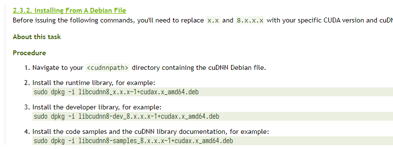

# 服务器维护手册

## 安装纯净系统

### 下载系统镜像 (.iso)

* **Ubuntu** (Debian): https://ubuntu.com/download/server
* **CentOS** (RHEL): https://www.centos.org/download/

### 使用镜像文件制作 USB 启动盘

* 下载 **Rufus**: https://rufus.ie/
* 找到并选择正确的 USB 设备和镜像文件，其他选项保持默认:


等待制作完成。

### Installation

* 关机并冷启动，在 BIOS 启动过程中调出启动菜单，选择 USB 设备作为启动设备。
* 可以全部使用默认选项进行安装，需要格外注意安装的硬盘不能选错。
* 一般在格式化硬盘的时候不启用 LVM Group。

## 安装后首次运行

### 配置网络

```console
user@host:~$ sudo vim /etc/netplan/00-installer-config.yaml
```
以如下形式启用固定 IP 定制和指定 DNS 服务器。
```
network:
  ethernets:
    eno1:
      dhcp4: no
      addresses: [192.168.1.X/24]
      gateway4: 192.168.1.1
      nameservers:
        addresses: [223.5.5.5,8.8.8.8]
  version: 2
```

启用固定 IP 后，NAT 端口转发才能正常使用。

记得应用配置：
```console
user@host:~$ sudo netplan apply
```

### 配置 SSH 服务器

```console
user@host:~$ sudo vim /etc/ssh/sshd_config
```
常用设置：
```
Port XXXX                    # SSH server listening port
UseDNS no
GSSAPIAuthentication no      # These two settings make SSH connection faster
PermitRootLogin no           # Prohibit root login
Match User admin,ubuntu      # Per-User settings
       PasswordAuthentication no
```
重启 SSH 服务以更新配置：
```console
user@host:~$ sudo service sshd restart
```

### 挂载硬盘

列出所有可用硬盘
```console
user@host:~$ sudo fdisk -l
Disk /dev/loop0: 29.9 MiB, 31334400 bytes, 61200 sectors
Units: sectors of 1 * 512 = 512 bytes
Sector size (logical/physical): 512 bytes / 512 bytes
I/O size (minimum/optimal): 512 bytes / 512 bytes


Disk /dev/loop1: 54.98 MiB, 57626624 bytes, 112552 sectors
Units: sectors of 1 * 512 = 512 bytes
Sector size (logical/physical): 512 bytes / 512 bytes
I/O size (minimum/optimal): 512 bytes / 512 bytes


Disk /dev/loop2: 71.28 MiB, 74735616 bytes, 145968 sectors
Units: sectors of 1 * 512 = 512 bytes
Sector size (logical/physical): 512 bytes / 512 bytes
I/O size (minimum/optimal): 512 bytes / 512 bytes


Disk /dev/sdb: 7.28 TiB, 8001563222016 bytes, 15628053168 sectors
Disk model: HGST HUS728T8TAL
Units: sectors of 1 * 512 = 512 bytes
Sector size (logical/physical): 512 bytes / 4096 bytes
I/O size (minimum/optimal): 4096 bytes / 4096 bytes
Disklabel type: gpt
Disk identifier: 41426009-6523-4E08-AEB4-3E0F118F50CF

Device     Start         End     Sectors  Size Type
/dev/sdb1   2048 15628053134 15628051087  7.3T Linux filesystem


Disk /dev/sda: 894.26 GiB, 960197124096 bytes, 1875385008 sectors
Disk model: SAMSUNG MZ7LH960
Units: sectors of 1 * 512 = 512 bytes
Sector size (logical/physical): 512 bytes / 4096 bytes
I/O size (minimum/optimal): 4096 bytes / 4096 bytes
Disklabel type: gpt
Disk identifier: 50B12219-3E72-4376-A057-5922B0C432B9

Device       Start        End    Sectors   Size Type
/dev/sda1     2048    1050623    1048576   512M EFI System
/dev/sda2  1050624 1875382271 1874331648 893.8G Linux filesystem
```

以 `dev/sdb1 (7.3T HDD disk)` 为例，要把它挂载到 `/mnt/hdd1` 上，首先编辑 `/etc/fstab`：
```console
user@host:~$ sudo vim /etc/fstab
```

添加一行：
```
/dev/sdb1 /mnt/hdd1 ext4 defaults 0 0
```
分别为硬盘设备路径，挂载路径，文件系统以及挂载选项。

执行挂载命令，若无报错信息且 `df` 命令可正确列出挂载的磁盘就完成了。
```console
user@host:~$ sudo mount -a
```

**注意**：
如果要使用最后一节的脚本来新建用户和更新文件夹信息的话，请将硬盘挂载到 `/mnt/` 中，如: `/mnt/hdd1`, `/mnt/hdd2`, `/mnt/ssd`.


### 驱动

https://developer.nvidia.com/cuda-downloads

选择正确的系统版本和系统架构， **不要使用** `.run` runfile 的方式安装。


依照网页上给出的指示操作，并重启系统。


**禁用 X**：
```console
sudo systemctl enable multi-user.target --force
sudo systemctl set-default multi-user.target
```
这些命令将 Linux 系统设置于无图形界面模式，这样可以完全停止 X 进程及释放其在 GPU 中的预留显存，并避免自动休眠。

### 安装 CUDA Toolkit

```console
sudo apt list cuda-toolkit*
```


```console
sudo apt install cuda-toolkit-xx-x
```

### （可选）安装 CuDNN, NCCL, TensorRT

* **CuDNN**

https://developer.nvidia.com/rdp/cudnn-download

依照 https://docs.nvidia.com/deeplearning/cudnn/install-guide/index.html 上的步骤操作。




* **NCCL**

https://developer.nvidia.com/nccl/nccl-download

依照 https://docs.nvidia.com/deeplearning/nccl/install-guide/index.html 上的步骤操作。


### （可选）Linux 软件源镜像

* 更改 `apt` 或 `yum` 的软件源镜像可有效提升速度。推荐：[Aliyun](https://developer.aliyun.com/mirror/) 和 [SJTU](https://mirrors.sjtug.sjtu.edu.cn/)，也可使用 [Tuna](https://mirrors.tuna.tsinghua.edu.cn/).
* `Pypi`，`Conda` 等软件源镜像也可在上述地址中找到。


### （可选）APT 自动更新

APT 自动更新使系统软件包始终最新，请酌情采用。

```console
user@host:~$ sudo crontab -e
42 3 * * * apt-get update && apt-get upgrade -y && apt-get dist-upgrade -y && apt-get autoremove
```

## 系统管理

**请小心使用此节提及的脚本**

这些脚本可以在这个目录里找到。你可以直接从网页拷贝到 `~` 下，或者使用 `git clone` 克隆下来。

### 创建新用户

```console
user@host:~$ sudo sh newuser.sh [username] [password]
```

### （仅限重装时使用）自动重设文件夹的所有者

重装后，原来的文件夹所有者信息会和当前不对应，要修复它，首先进入 `/mnt/hdd1` 目录:

```console
user@host:~$ cd /mnt/hdd1
```

然后使用下面的命令更新所有者。例如，`alien` 文件夹的所有者会被更新为 `alien:alien`。

```console
user@host:/mnt/hdd1$ find . -maxdepth 1 -type d | sudo bash ~/set.sh
```

### 将一个用户添加到 Sudoers

In Ubuntu or Debian:
```console
user@host:~$ sudo usermod -aG sudo USERNAME
```

In CentOS or RHEL:
```console
user@host:~$ sudo usermod -aG wheel USERNAME
```
